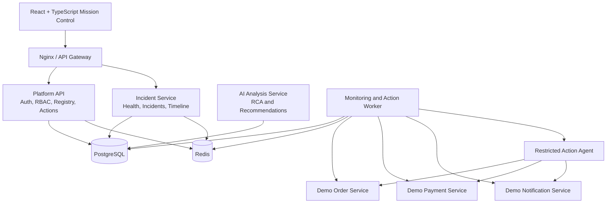

# NEXUS

> **AI-powered mission control and controlled self-healing for microservice applications.**

NEXUS monitors distributed services, detects operational incidents, maps their likely blast radius, assists engineers with evidence-based root-cause analysis, coordinates role-based recovery approvals, executes restricted remediation actions, verifies recovery, and generates a complete incident report.

---

## Project Status

**Current stage:** Planning and repository initialization  
**Current target:** Version 1.0  
**Development approach:** Build one complete failure-to-recovery vertical slice first, then expand safely.

NEXUS is currently a portfolio and learning project designed to demonstrate production-grade full-stack engineering with:

- Python and FastAPI
- React and TypeScript
- PostgreSQL and async SQLAlchemy
- Async Python and concurrent background processing
- REST APIs and real-time event delivery
- Microservice architecture
- Docker and Linux environments
- CI/CD pipelines
- OAuth 2.0, JWT, and RBAC
- Cloud deployment on AWS
- AI-assisted incident investigation

---

## Vision

Modern engineering teams investigate failures across logs, dashboards, cloud consoles, deployments, alerts, and chat tools. NEXUS brings the essential incident-response workflow into one operational control plane.

The long-term vision is:

> Detect service degradation early, explain the likely cause with evidence, recommend safe actions, require the correct human approvals, execute only predefined remediations, and verify that the system actually recovered.

NEXUS is not intended to replace every monitoring or incident-management platform. It focuses on the workflow between **detection**, **understanding**, **controlled action**, and **verified recovery**.

---

## Core Product Story

A microservice starts failing.

NEXUS:

1. Detects repeated health-check failures or abnormal latency.
2. Identifies affected dependencies.
3. Creates a single active incident instead of duplicate alerts.
4. Builds a live incident timeline.
5. Collects relevant health data, logs, metrics, and deployment context.
6. Produces a structured AI-assisted investigation.
7. Recommends predefined recovery actions.
8. Requires approval from an authorized user.
9. Executes the approved action asynchronously.
10. Runs multiple verification checks.
11. Resolves the incident only after confirmed recovery.
12. Generates an incident report and audit trail.

---

## Why NEXUS Is Different

NEXUS is not another CRUD dashboard or Jira clone.

Its key differentiators are:

- Live service dependency topology
- Async service-health monitoring
- Automatic incident creation and deduplication
- Blast-radius visualization
- Evidence-based AI root-cause assistance
- Human approval checkpoints
- Restricted operational actions
- Recovery verification
- Complete auditability
- Incident reports generated from real event history

---

## Target Users

### Viewer

Can inspect environments, services, health history, and incidents.

### Engineer

Can investigate incidents, comment, acknowledge incidents, and request recovery actions.

### Incident Commander

Can approve or reject sensitive operational actions and close major incidents.

### Administrator

Can manage organizations, users, roles, environments, services, integrations, and policies.

---

# Version Strategy

## Version 1.0 — Mission Control MVP

Version 1 proves the complete operational workflow with a controlled demo microservice system.

### Primary objective

Deliver one polished, production-style scenario:

> Payment Service degradation is detected, an incident is opened, dependent services are highlighted, an AI investigation is generated, an engineer requests recovery, an Incident Commander approves it, NEXUS executes the action, verifies recovery, and creates a final report.

### Version 1 capabilities

#### Identity and access

- Email and password registration
- Secure password hashing
- Login and logout
- JWT access tokens
- Rotating refresh tokens
- Token revocation
- Google OAuth 2.0
- Multi-tenant organizations
- Role-based access control
- Backend permission enforcement
- Audit logging for security-sensitive actions

#### Service registry

- Environments such as development, staging, and production
- Service registration
- Health-check URL
- Expected latency threshold
- Service owner
- Repository URL
- Current version
- Dependency relationships
- Allowed recovery actions

#### Monitoring

- Concurrent health checks using `asyncio`
- Bounded concurrency
- Per-request timeouts
- Retry policies
- Consecutive-failure thresholds
- Consecutive-success recovery thresholds
- Health-history persistence
- Graceful worker shutdown

#### Incident management

- Automatic incident creation
- Incident deduplication
- Severity levels
- Service state transitions
- Incident timeline
- Comments and acknowledgements
- Affected-service calculation
- Recovery state tracking
- Incident closure rules

#### Mission Control UI

- Overall system-health summary
- Live service topology
- Healthy, degraded, critical, offline, recovering, and maintenance states
- Active incident list
- Service latency history
- Incident War Room
- Recovery approval interface
- Audit log viewer
- Live updates through Server-Sent Events

#### AI-assisted investigation

- Mock incident analyzer for deterministic development
- Optional external AI provider
- Structured Pydantic-validated output
- Probable cause
- Confidence score
- Evidence list
- Affected services
- Recommended predefined actions
- Sensitive-data redaction
- Human review before action

#### Controlled recovery

- Request action
- Approve or reject action
- Prevent self-approval for high-risk actions
- Execute only allow-listed actions
- Prevent duplicate execution
- Track execution result and duration
- Verify service recovery
- Resolve only after successful verification

#### Demo services

- Order Service
- Payment Service
- Notification Service
- Development-only failure simulation
- Latency injection
- Error-rate injection
- Unavailable-state simulation
- Recovery endpoint

#### Engineering quality

- Async SQLAlchemy
- Alembic migrations
- REST API versioning
- Structured error responses
- Request IDs
- Structured JSON logging
- Health and readiness endpoints
- Pytest
- Frontend unit tests
- Playwright end-to-end test
- Docker Compose
- GitHub Actions
- AWS deployment
- HTTPS
- Documentation

---

## Version 1.1 — Integrations and Better Operations

After Version 1 is stable:

- GitHub deployment synchronization
- Slack incident notifications
- Email alerts
- Resend integration
- Sentry integration
- Downloadable incident reports
- Custom monitoring intervals
- Configurable escalation rules
- Deployment markers on latency graphs
- Saved incident filters
- Service ownership teams
- Maintenance windows
- Webhook ingestion
- Webhook delivery retries

---

## Version 2.0 — Production Infrastructure Awareness

- AWS resource discovery
- ECS service monitoring
- CloudWatch log and metric ingestion
- Kubernetes service discovery
- Prometheus integration
- OpenTelemetry traces
- Centralized log search
- Deployment rollback requests
- Feature-flag integrations
- Runbook templates
- Multi-step recovery workflows
- On-call schedules
- SLA and SLO policies
- Incident postmortem editor

---

## Version 3.0 — Intelligent Reliability Automation

- Anomaly detection
- Incident correlation
- Predictive service-risk scoring
- Similar-incident retrieval
- Automated runbook recommendation
- Safe policy-based auto-remediation
- Canary verification
- Cost anomaly detection
- Multi-cloud monitoring
- Cross-region incident analysis
- Reliability scorecards
- Organization-level operational analytics

---

# Version 1 Non-Goals

The following are intentionally excluded from Version 1:

- Kubernetes control
- Arbitrary shell-command execution
- Fully autonomous AI remediation
- Subscription billing
- Mobile applications
- PagerDuty replacement
- Full log-management platform
- Full APM replacement
- Multi-cloud infrastructure
- Advanced machine-learning anomaly detection
- Custom workflow builder
- User-created executable scripts
- Complex on-call scheduling
- Public marketplace integrations

These exclusions protect the scope and help us launch a polished first version.

---

# Success Metrics for Version 1

NEXUS Version 1 is successful when:

- A registered service can be monitored continuously.
- Three consecutive failures create exactly one incident.
- The dependency graph highlights likely affected services.
- The UI updates without a browser refresh.
- AI analysis returns schema-valid structured output.
- An Engineer can request but not approve a restricted action.
- An Incident Commander can approve the action.
- The action is executed exactly once.
- Recovery is verified through multiple successful checks.
- The incident is resolved only after verification.
- Every sensitive action is visible in the audit log.
- The full scenario works through an automated end-to-end test.
- The application is publicly deployed with HTTPS.

---

# High-Level Architecture



---

# Architectural Strategy

## Build a vertical slice first

The first working slice will contain:

1. One Payment Service
2. One health-check worker
3. One persisted service record
4. One incident rule
5. One live dashboard card
6. One failure simulation
7. One recovery action
8. One audit event

Once this flow works, we will expand to organizations, RBAC, service topology, AI analysis, and cloud deployment.

## Use meaningful service boundaries

Version 1 contains separate deployable units where separation adds real value:

- Platform API
- Incident Service
- Monitoring and Action Worker
- AI Analysis Service
- Restricted Action Agent
- Demo microservices
- React web application

We will avoid creating unnecessary services only to increase the service count.

## Prefer safe, deterministic behavior

- No arbitrary shell input
- No AI-generated commands
- No silent automatic remediation
- No incident closure without verification
- No cross-tenant access
- No duplicate execution
- No secrets in logs

## Keep AI optional

The core platform must work without a paid AI API.

Development begins with `MockIncidentAnalyzer`. An external provider is added behind an interface only after the complete incident workflow works deterministically.

---

# Technology Stack

## Backend

- Python 3.12+
- FastAPI
- Pydantic
- SQLAlchemy 2.x async
- Alembic
- PostgreSQL
- Redis
- `asyncio`
- `httpx`
- Argon2 password hashing
- PyJWT or `python-jose`
- Pytest
- Ruff
- MyPy

## Frontend

- React
- TypeScript
- Vite
- React Router
- TanStack Query
- React Hook Form
- Zod
- Zustand
- React Flow
- Recharts
- Vitest
- React Testing Library
- Playwright

## Infrastructure

- Docker
- Docker Compose
- Nginx
- GitHub Actions
- Linux
- AWS EC2 or ECS
- AWS RDS PostgreSQL
- AWS ECR
- AWS S3
- AWS CloudWatch
- AWS Secrets Manager or Parameter Store

---

# Functional Requirements

## Authentication

- Users can register with email and password.
- Users can log in and receive access and refresh tokens.
- Access tokens are short-lived.
- Refresh tokens are rotated and revocable.
- Users can sign in with Google OAuth.
- Authentication failures use consistent error responses.

## Authorization

- Authorization is enforced on the backend.
- Resources are isolated by organization.
- Roles map to granular permissions.
- High-risk actions require an Incident Commander or Admin.
- High-risk actions cannot be self-approved.
- Authorization failures are audited when appropriate.

## Service Registry

A service includes:

- Name
- Slug
- Organization
- Environment
- Base URL
- Health-check URL
- Readiness URL
- Expected latency
- Owner
- Repository URL
- Current version
- Status
- Allowed recovery actions

## Monitoring

The monitoring engine must:

- Query multiple services concurrently.
- Limit concurrency.
- Apply timeouts.
- Record response time.
- Record status code.
- Record normalized health state.
- Retry transient failures.
- avoid duplicate health records for the same check execution.
- shut down gracefully.

## Incident Rules

Default Version 1 rules:

- One failure: record only.
- Three consecutive failures: create incident.
- Latency above threshold: degraded.
- Repeated latency breaches: high-severity incident.
- Three consecutive successes after remediation: recovered.
- An unresolved incident prevents duplicate incidents for the same service and failure type.

## AI Analysis

AI output must contain:

- Probable cause
- Confidence score
- Evidence
- Affected services
- Recommended predefined actions
- Risk level
- Missing context
- Analysis timestamp
- Provider name
- Model name when applicable

## Recovery Actions

Initial allow-listed actions:

- `run_health_check`
- `restart_service`
- `enable_maintenance_mode`
- `disable_maintenance_mode`
- `retry_failed_jobs`
- `restore_demo_service`

## Recovery Verification

A successful command is not enough.

NEXUS must:

- wait for service initialization,
- perform multiple health checks,
- compare health and latency,
- mark verification as successful or failed,
- keep the incident open when verification fails.

---

# Non-Functional Requirements

## Security

- Passwords are hashed with Argon2.
- Secrets are never committed.
- Tokens are never written to logs.
- CORS is restricted by environment.
- Rate limits protect authentication and action endpoints.
- Recovery actions are allow-listed.
- Docker control is isolated behind a restricted agent.
- Every organization-owned query includes tenant filtering.
- Production uses HTTPS.
- Security-sensitive actions create audit events.

## Reliability

- Background jobs support retries.
- Jobs are idempotent where required.
- Duplicate action execution is prevented.
- Monitoring continues when AI is unavailable.
- Incident creation uses transactional protection.
- Readiness endpoints check critical dependencies.
- Workers support graceful shutdown.

## Performance

Initial Version 1 targets:

- Monitor 25 services.
- Monitoring interval: 10 seconds.
- Maximum concurrent checks: 5.
- Dashboard API p95 target: below 500 ms locally.
- Live event propagation target: below 2 seconds.
- Paginate all potentially large resources.

## Maintainability

- Clear service boundaries
- Type hints
- Pydantic request and response models
- Repository and service layers where useful
- Small modules
- Consistent API conventions
- Automated formatting and linting
- Architecture decisions documented

## Observability

- Structured JSON logs
- Request IDs
- Correlation IDs
- Service name
- Organization ID where safe
- Job attempt count
- Action duration
- Health-check duration
- Error stack traces
- Metrics-ready event design

---

# API Conventions

## Base path

```text
/api/v1
```

## Example resources

```text
/api/v1/auth
/api/v1/organizations
/api/v1/members
/api/v1/environments
/api/v1/services
/api/v1/dependencies
/api/v1/incidents
/api/v1/actions
/api/v1/approvals
/api/v1/audit-logs
/api/v1/events
```

## Error format

```json
{
  "error": {
    "code": "SERVICE_NOT_FOUND",
    "message": "The requested service was not found.",
    "request_id": "req_123"
  }
}
```

## API requirements

- Pagination
- Filtering
- Sorting
- Versioned routes
- OpenAPI documentation
- Consistent status codes
- Validation errors mapped to a stable format
- Idempotency keys for sensitive action requests

---

# Initial Data Model

## Identity

- `users`
- `organizations`
- `organization_members`
- `roles`
- `permissions`
- `role_permissions`
- `refresh_tokens`
- `oauth_accounts`

## Service Registry

- `environments`
- `services`
- `service_dependencies`
- `service_credentials`

## Monitoring

- `health_checks`
- `service_metrics`
- `monitoring_rules`

## Incidents

- `incidents`
- `incident_events`
- `incident_comments`
- `incident_analyses`
- `incident_reports`

## Recovery

- `recovery_actions`
- `action_approvals`
- `action_executions`
- `recovery_verifications`

## Governance and Jobs

- `audit_logs`
- `outbox_events`
- `background_jobs`

---

# Repository Structure

```text
nexus/
├── apps/
│   └── web/
│       ├── src/
│       ├── tests/
│       └── Dockerfile
│
├── services/
│   ├── platform-api/
│   │   ├── app/
│   │   ├── tests/
│   │   ├── alembic/
│   │   └── Dockerfile
│   │
│   ├── incident-service/
│   │   ├── app/
│   │   ├── tests/
│   │   └── Dockerfile
│   │
│   ├── monitoring-worker/
│   │   ├── app/
│   │   ├── tests/
│   │   └── Dockerfile
│   │
│   ├── ai-service/
│   │   ├── app/
│   │   ├── providers/
│   │   ├── tests/
│   │   └── Dockerfile
│   │
│   └── action-agent/
│       ├── app/
│       ├── tests/
│       └── Dockerfile
│
├── demo/
│   ├── order-service/
│   ├── payment-service/
│   └── notification-service/
│
├── packages/
│   ├── python-common/
│   └── contracts/
│
├── infrastructure/
│   ├── nginx/
│   ├── aws/
│   └── scripts/
│
├── docs/
│   ├── architecture/
│   ├── decisions/
│   ├── api/
│   └── runbooks/
│
├── .github/
│   └── workflows/
│
├── docker-compose.yml
├── docker-compose.production.yml
├── Makefile
├── .env.example
├── CONTRIBUTING.md
└── README.md
```

---

# Development Roadmap

## Phase 0 — Repository and standards

- Create blank GitHub repository.
- Add README.
- Add `.gitignore`.
- Add `.editorconfig`.
- Add license decision.
- Add branch-protection rules.
- Define commit convention.
- Create initial project board.
- Add architecture decision record template.

## Phase 1 — Local foundation

- Create React TypeScript application.
- Create Platform FastAPI service.
- Add PostgreSQL.
- Add Redis.
- Add Docker Compose.
- Add Nginx.
- Add health endpoints.
- Configure Ruff, MyPy, Pytest, ESLint, and TypeScript checks.
- Add initial CI workflow.

## Phase 2 — Demo Payment Service

- Create Payment Service.
- Add liveness and readiness endpoints.
- Add artificial latency.
- Add artificial errors.
- Add unavailable state.
- Add restore action.
- Display service health in the frontend.

## Phase 3 — Database and service registry

- Configure async SQLAlchemy.
- Add Alembic.
- Add environments.
- Add services.
- Add dependencies.
- Add initial CRUD APIs.
- Render dynamic service topology.

## Phase 4 — Monitoring worker

- Add concurrent checks.
- Add semaphore.
- Add timeouts.
- Add retries.
- Persist health checks.
- Create service-state transitions.
- Add graceful shutdown.

## Phase 5 — Incident engine

- Add incident rules.
- Add incident deduplication.
- Add severities.
- Add timeline events.
- Add affected-service calculation.
- Add recovery conditions.

## Phase 6 — Authentication and RBAC

- Registration
- Login
- Refresh tokens
- Logout
- Organizations
- Memberships
- Permissions
- Google OAuth
- Tenant isolation
- Audit logging

## Phase 7 — Live Mission Control

- Server-Sent Events
- Live topology
- Active incidents
- Latency graphs
- War Room
- Comments
- Acknowledgements
- Live timeline

## Phase 8 — Controlled recovery

- Action requests
- Approval flow
- Restricted agent
- Idempotent execution
- Execution logs
- Recovery verification
- Audit events

## Phase 9 — AI analysis

- Mock provider
- Provider interface
- Structured schemas
- Context building
- Evidence linking
- Optional external provider
- Failure handling
- Sensitive-data redaction

## Phase 10 — Hardening and deployment

- Backend tests
- Frontend tests
- Playwright scenario
- Security controls
- Structured logging
- Docker production builds
- GitHub Actions deployment
- AWS infrastructure
- HTTPS
- Monitoring
- Documentation
- Demo video

---

# First Vertical Slice

Before implementing the full architecture, we will complete this smaller flow:

1. Start Payment Service through Docker.
2. Register it in PostgreSQL.
3. Monitor it every 10 seconds.
4. Show its state in React.
5. Trigger artificial latency.
6. Mark the service degraded.
7. Create one incident after repeated failures.
8. Request a restore action.
9. Execute the allow-listed recovery action.
10. Verify successful health checks.
11. Resolve the incident.
12. Display the event history.

This slice proves the central value of NEXUS.

---

# Testing Strategy

## Backend

- Unit tests
- API integration tests
- Database tests
- Permission tests
- Tenant-isolation tests
- Incident-rule tests
- Incident-deduplication tests
- Job-retry tests
- Action-idempotency tests
- Recovery-verification tests
- AI-schema tests

## Frontend

- Component tests
- Form-validation tests
- Role-based rendering tests
- Live-event tests
- Incident-state tests

## End-to-End

The critical Playwright scenario:

1. Log in as Engineer.
2. View healthy Payment Service.
3. Trigger Payment Service failure.
4. Wait for incident detection.
5. Request service recovery.
6. Log in as Incident Commander.
7. Approve the action.
8. Verify action execution.
9. Verify service recovery.
10. Verify incident resolution.
11. Verify audit and incident report entries.

---

# CI/CD Strategy

## Pull Requests

- Python formatting check
- Python linting
- Python type checking
- Backend tests
- Frontend linting
- TypeScript checking
- Frontend tests
- Docker image builds
- Optional end-to-end tests

## Main Branch

- Run all checks
- Build versioned Docker images
- Tag with commit SHA
- Push to AWS ECR
- Run database migrations
- Deploy containers
- Run readiness checks
- Mark deployment successful
- Preserve rollback information

---

# Deployment Strategy

## Development

- Docker Compose
- Local PostgreSQL
- Local Redis
- Mock AI provider

## Initial public demo

- AWS EC2
- RDS PostgreSQL
- Redis in Docker initially
- ECR
- CloudWatch
- S3
- Nginx or Application Load Balancer
- Route 53
- HTTPS certificate
- Secrets Manager or Parameter Store

## Later scale

- ECS Fargate
- ElastiCache
- Multi-AZ RDS
- Load-balanced workers
- Dedicated AI workers
- OpenTelemetry
- Prometheus
- Centralized logs

---

# Required Accounts and Tools

## Required accounts

| Account | Purpose | Initial cost expectation |
|---|---|---|
| GitHub | Repository and CI/CD | Free plan is sufficient initially |
| Docker | Local containers and Compose | Free for individual development |
| Google Cloud | OAuth credentials | Account required |
| AWS | Public cloud deployment | Usage-based; credits may apply |
| Domain registrar | Public domain | Paid yearly |
| Google account | OAuth and testing | Existing account is sufficient |

## Optional services

| Service | Purpose | When needed |
|---|---|---|
| OpenAI API | External AI incident analysis | After mock provider works |
| Resend | Transactional email | Version 1.1 or late Version 1 |
| Sentry | Error monitoring | During production hardening |
| Figma | UI design | Optional |
| Postman | API testing | Optional; OpenAPI UI is available |

## Paid items to expect

Potential paid costs:

- Custom domain
- AWS usage after credits or free allowance
- External AI API usage
- Email usage above free allowance
- Optional monitoring services above free limits

The application must remain fully functional locally without paid services.

---

# Environment Variables

```bash
APP_ENV=
APP_NAME=
LOG_LEVEL=

DATABASE_URL=
REDIS_URL=

JWT_SECRET=
JWT_REFRESH_SECRET=
ACCESS_TOKEN_TTL_MINUTES=
REFRESH_TOKEN_TTL_DAYS=

GOOGLE_CLIENT_ID=
GOOGLE_CLIENT_SECRET=
GOOGLE_REDIRECT_URI=

AI_PROVIDER=
OPENAI_API_KEY=

RESEND_API_KEY=
EMAIL_FROM=

SENTRY_DSN=

AWS_REGION=
S3_BUCKET_NAME=
```

Only `.env.example` will be committed.

Production secrets must be stored outside the repository.

---

# Branching and Commit Strategy

## Branches

- `main`: deployable code
- Short-lived feature branches
- Pull requests required before merging

## Suggested branch names

```text
feat/payment-service
feat/monitoring-worker
feat/service-registry
fix/incident-deduplication
test/recovery-flow
docs/architecture
```

## Commit convention

```text
feat: add payment service health endpoints
fix: prevent duplicate active incidents
test: cover incident recovery verification
docs: document action approval policy
chore: configure backend linting
refactor: extract health state evaluator
```

---

# Engineering Rules

- Write code that can be explained line by line.
- Prefer clarity over cleverness.
- Keep modules focused.
- Add tests for critical behavior.
- Keep migrations reversible where possible.
- Do not bypass permissions in the UI or API.
- Do not place business logic directly inside route handlers.
- Do not expose arbitrary command execution.
- Do not automatically trust AI output.
- Do not mark recovery complete without verification.
- Do not log credentials or tokens.
- Do not merge failing CI.
- Document important architectural decisions.

---

# Architecture Decision Records

Important decisions will be recorded under:

```text
docs/decisions/
```

Initial ADRs:

1. Why NEXUS uses Server-Sent Events in Version 1
2. Why recovery actions are allow-listed
3. Why AI cannot execute actions directly
4. Why Version 1 uses one PostgreSQL instance
5. Why the Docker action agent is isolated
6. Why monitoring uses bounded concurrency
7. Why incidents require deduplication
8. Why recovery requires multiple successful checks

---

# Risks and Mitigations

## Scope growth

**Risk:** Adding Kubernetes, AWS discovery, Slack, and advanced AI too early.

**Mitigation:** Version 1 non-goals are fixed until the core demo works.

## Unsafe container control

**Risk:** Public APIs gain excessive Docker access.

**Mitigation:** Use an internal restricted action agent and predefined actions.

## AI unreliability

**Risk:** AI returns incorrect or invalid recommendations.

**Mitigation:** Validate schemas, display evidence, require human approval, and keep AI optional.

## Duplicate actions

**Risk:** Retries execute the same recovery action more than once.

**Mitigation:** Use idempotency keys, unique constraints, and execution state locking.

## Cross-tenant data leakage

**Risk:** One organization accesses another organization's services or incidents.

**Mitigation:** Tenant filters, authorization tests, and organization-scoped repositories.

## False incident creation

**Risk:** Temporary network failure creates noisy incidents.

**Mitigation:** Consecutive-failure thresholds and incident deduplication.

## Cost growth

**Risk:** Cloud or AI costs increase unexpectedly.

**Mitigation:** Budget alerts, mock AI, small infrastructure, and usage limits.

---

# Definition of Done for Version 1

Version 1 is complete when:

- The application is publicly available through HTTPS.
- Authentication and Google OAuth work.
- RBAC is enforced by backend APIs.
- Organization data is isolated.
- Services and dependencies are created dynamically.
- Monitoring runs asynchronously.
- Incidents are created and deduplicated correctly.
- Mission Control updates in real time.
- AI analysis is structured and reviewable.
- Recovery requires the correct approval.
- Recovery actions are allow-listed and idempotent.
- Recovery is verified before resolution.
- Audit logs capture sensitive operations.
- CI/CD builds, tests, and deploys the system.
- Production migrations run safely.
- Logs contain no credentials or tokens.
- The critical Playwright scenario passes.
- Local and cloud setup are documented.
- Architecture diagrams are included.
- A short product demonstration is recorded.

---

# Planned Demo

The final Version 1 demonstration will show:

1. All demo services are healthy.
2. Payment Service latency is activated.
3. NEXUS detects repeated degradation.
4. An incident is opened.
5. Order Service is shown as affected.
6. AI analysis identifies Payment Service as the likely cause.
7. An Engineer requests recovery.
8. An Incident Commander approves it.
9. NEXUS restores the service.
10. Multiple health checks verify recovery.
11. The incident is resolved.
12. The incident report and audit trail are displayed.

---

# Getting Started

Implementation has not started yet.

The next step is to initialize a blank GitHub repository and complete **Phase 0 — Repository and Standards**.

The first technical milestone will be:

> A Dockerized React dashboard displaying the live health of a Dockerized FastAPI Payment Service.

---

# License

License to be selected before the first public release.

---

# Project Name

**NEXUS**

**Working tagline:**  
*Detect. Understand. Approve. Recover.*
